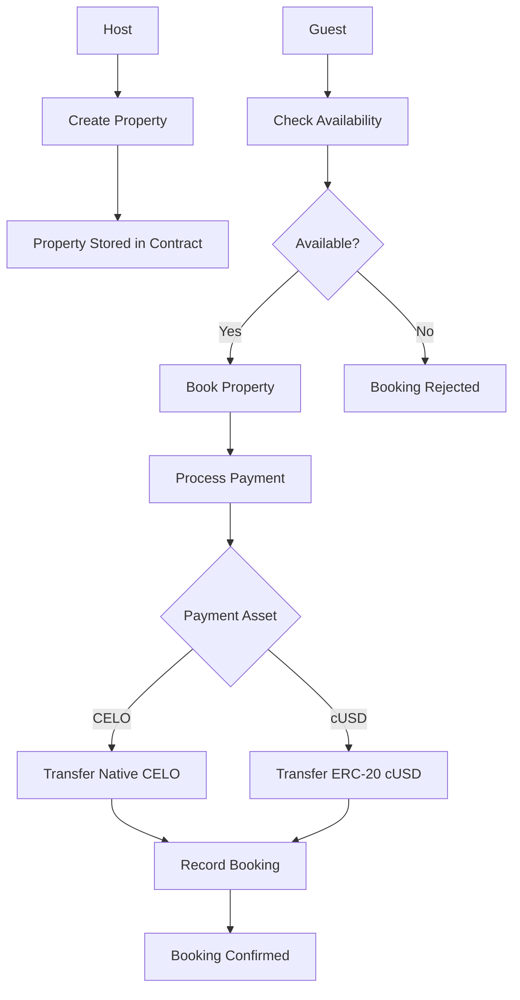

# LedgerLounge

[](https://opensource.org/licenses/MIT)
[](https://soliditylang.org/)
[](https://getfoundry.sh/)
[](https://celo.org/)

LedgerLounge is an onchain real estate booking and payments protocol on the Celo network that lets hosts list properties and guests book stays using either native CELO or cUSD stablecoins. This smart contract ensures secure, decentralized property bookings with direct payments to hosts, preventing double-bookings and providing transparency.

## Features

- **Property Listings**: Hosts can create and manage property listings with metadata, pricing, and payment preferences.
- **Secure Bookings**: Guests can book date ranges with automatic overlap prevention.
- **Flexible Payments**: Support for both CELO (native) and cUSD (ERC-20) payments.
- **Direct Payments**: Funds are transferred directly from guest to host upon booking.
- **On-Chain Transparency**: All bookings and transactions are recorded immutably on the blockchain.
- **Celo Integration**: Optimized for the Celo network with support for stablecoins.

## Architecture

The LedgerLounge contract operates as a decentralized booking system with the following key components:



### Contract Structure

- **Properties**: Stored with host address, details, pricing, and status.
- **Bookings**: Linked to properties with guest info, dates, and payment details.
- **Payment Handling**: Supports native transfers and ERC-20 approvals/transfers.
- **Availability Checks**: Prevents overlapping bookings for the same property.

## Installation

### Prerequisites

- [Foundry](https://getfoundry.sh/) for building and testing
- [Node.js](https://nodejs.org/) (optional, for additional tooling)

### Setup

1. Clone the repository:
   ```bash
   git clone https://github.com/yourusername/LedgerLounge-Contract.git
   cd LedgerLounge-Contract
   ```

2. Install dependencies:
   ```bash
   forge install
   ```

3. Build the contract:
   ```bash
   forge build
   ```

## Usage

### Deploying the Contract

Use the provided deployment script with your keystore:

```bash
forge script script/DeployLedgerLounge.s.sol --rpc-url https://forno.celo-sepolia.celo-testnet.org --keystore celoKey --broadcast
```

You'll be prompted to enter your keystore password. Make sure your keystore file is set up in Foundry's default location (`~/.foundry/keystores/celoKey`).
**Deployed Contract Address (Celo Sepolia):** `0x840827F42688743B36F794CA6f94DCC336909C50`

View on Blockscout: https://celo-sepolia.blockscout.com/address/0x840827F42688743B36F794CA6f94DCC336909C50
For mainnet deployment, use:
```bash
forge script script/DeployLedgerLounge.s.sol --rpc-url https://forno.celo.org --keystore celoKey --broadcast --verify
```

### Interacting with the Contract

#### Creating a Property

```solidity
ledgerLounge.createProperty(
    "Beach House",
    "Miami, FL",
    "ipfs://metadata-uri",
    1000000000000000000, // 1 CELO in wei
    0 // 0 for CELO, 1 for cUSD
);
```

#### Booking a Property

```solidity
// For CELO payment
ledgerLounge.book{value: totalPrice}(propertyId, checkInTimestamp, checkOutTimestamp);

// For cUSD payment (approve contract first)
cusd.approve(address(ledgerLounge), totalPrice);
ledgerLounge.book(propertyId, checkInTimestamp, checkOutTimestamp);
```

#### Checking Availability

```solidity
bool available = ledgerLounge.isDateRangeAvailable(propertyId, checkIn, checkOut);
```

## Testing

Run the test suite using Foundry:

```bash
forge test
```

Run tests with gas reporting:

```bash
forge test --gas-report
```

Run specific tests:

```bash
forge test --match-test testCreateProperty
```

## Contributing

We welcome contributions from the community! Whether you're a seasoned developer or just starting your blockchain journey, LedgerLounge is a great project to learn, collaborate, and build decentralized applications. Here's how you can get involved:

### For Learners

If you're new to blockchain development, smart contracts, or Solidity, this project offers excellent learning opportunities:

- **Understand Real-World Use Cases**: Learn how decentralized applications can solve real problems in real estate booking.
- **Hands-On Experience**: Contribute by writing tests, improving documentation, or adding features.
- **Best Practices**: Study the code to learn about secure smart contract development, gas optimization, and on-chain data structures.
- **Community Support**: Join discussions to ask questions and learn from experienced contributors.

**Getting Started as a Learner:**
1. Read the [Solidity Documentation](https://docs.soliditylang.org/)
2. Explore the contract code in `src/LedgerLounge.sol`
3. Run the tests to understand expected behavior
4. Try modifying a test or adding a simple feature

### Development Setup

1. Fork the repository
2. Create a feature branch: `git checkout -b feature/your-feature`
3. Make your changes
4. Run tests: `forge test`
5. Format code: `forge fmt`
6. Commit your changes: `git commit -am 'Add some feature'`
7. Push to the branch: `git push origin feature/your-feature`
8. Submit a pull request

### Code Style

- Follow Solidity style guide
- Use descriptive variable and function names
- Add NatSpec comments for all public functions
- Write comprehensive tests for new features
- Keep functions small and focused on single responsibilities

### Contribution Opportunities

- **Bug Fixes**: Identify and fix issues in the contract logic
- **Feature Additions**: Implement new functionalities like property reviews or dispute resolution
- **Testing**: Write more comprehensive test cases, including edge cases and fuzzing
- **Documentation**: Improve README, add code comments, or create tutorials
- **Gas Optimization**: Optimize contract functions for lower gas costs
- **Security Audits**: Review code for potential vulnerabilities

### Development Workflow

1. **Issue Tracking**: Check [GitHub Issues](https://github.com/yourusername/LedgerLounge-Contract/issues) for open tasks
2. **Discussion**: Use issue comments or pull request discussions for design decisions
3. **Code Review**: All PRs require review from at least one maintainer
4. **Testing**: Ensure all tests pass and add new tests for changes
5. **Merge**: Once approved, maintainers will merge your contribution

### Learning Resources

- [Foundry Book](https://book.getfoundry.sh/) - Learn about smart contract testing and deployment
- [OpenZeppelin Documentation](https://docs.openzeppelin.com/contracts/) - Best practices for secure contracts
- [Celo Documentation](https://docs.celo.org/) - Learn about the Celo ecosystem
- [Solidity by Example](https://solidity-by-example.org/) - Practical Solidity tutorials
- Join our [Discord](https://discord.gg/yourinvite) for discussions and mentorship

### Reporting Issues

- Use GitHub Issues to report bugs or request features
- Provide detailed steps to reproduce bugs
- Include relevant contract addresses and transaction hashes when applicable
- For security issues, please email security@ledgerlounge.com instead of posting publicly

### Community Guidelines

- Be respectful and inclusive
- Provide constructive feedback
- Help newcomers learn and grow
- Follow the [Code of Conduct](CODE_OF_CONDUCT.md) (create one if needed)
- Celebrate contributions of all sizes

## Security

This contract has been developed with security best practices in mind, but smart contracts are experimental technology. Please:

- Audit the code before using in production
- Test thoroughly on testnets before mainnet deployment
- Use at your own risk

## License

This project is licensed under the MIT License - see the [LICENSE](LICENSE) file for details.

## Acknowledgments

- Built with [Foundry](https://getfoundry.sh/)
- Uses [OpenZeppelin Contracts](https://openzeppelin.com/contracts/)
- Inspired by decentralized real estate platforms

---

For more information, visit our [documentation](https://github.com/yourusername/LedgerLounge-Contract/wiki) or join our [Discord community](https://discord.gg/yourinvite).
